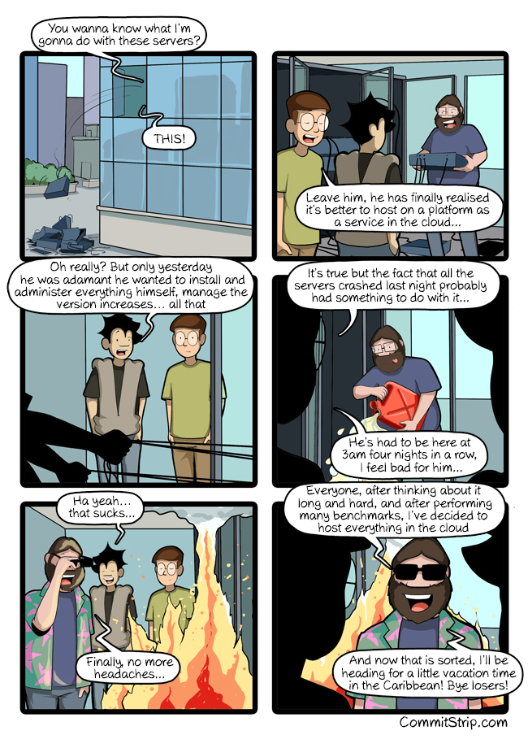

# OCI_Native_NewsApp
The app will gather &amp; store news CSVs for further analysis.

  

[source](http://www.commitstrip.com/en/2019/01/08/the-cloud-at-last/)

# Introduction

The gold-standard cloud native app for OCI is of course, [MuShop](https://github.com/oracle-quickstart/oci-cloudnative). However, this repo contains the code for a substantially different use case. 

This API receives GET requests that trigger pulling from [newsapi](https://newsapi.org/). The returned JSON is then written to csv files that are uploaded to an object storage bucket. Lastly, the endpoint then deletes the csv files from local storage. 

# Pre-requisites

Oracle CLI installed, the sh scripts rely upon this.

A file just named 'apikey' that contains your newsapi.org key. Inspired by this [implementation](https://github.com/dylburger/reading-api-key-from-file/blob/master/Keeping%20API%20Keys%20Secret.ipynb). 

# How it was made

## Creation of requirements.txt

https://medium.com/python-pandemonium/better-python-dependency-and-package-management-b5d8ea29dff1

## Creation of dockerfile

